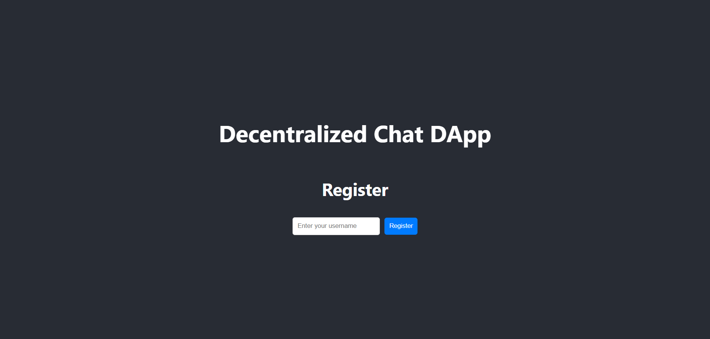
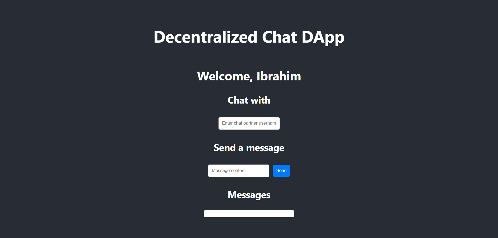

# Decentralized Chat DApp

This is a decentralized chat application built on Ethereum blockchain. Users can register with a username, send messages to other registered users, and view their chat history. The frontend is built with React, and the smart contract is written in Solidity.

## Features

- User registration with unique usernames.
- Send and receive messages between registered users.
- View chat history with individual users.
- Messages are stored on the Ethereum blockchain.

## Prerequisites

- Node.js (version 12.x or later)
- Truffle (version 5.x or later)
- MetaMask extension in your browser
- Ganache for local blockchain development (optional, but recommended for testing)

## Getting Started

### 1. Clone the repository

```bash
git clone https://github.com/yourusername/decentralized-chat-dapp.git
cd decentralized-chat-dapp
```

### 2. Install dependencies

```bash
cd frontEnd
cd chat
npm install
```

### 3. Deploy the smart contract

Make sure you have Ganache running for local development. Then, in the root directory of your project:

```bash
cd ../..
cd truffle compile
truffle migrate --reset
```

This will deploy the smart contract to your local blockchain. Note the contract address, as you will need to update the frontend configuration with this address.

### 4. Update frontend configuration

In `frontEnd/chat/src/constants/constant.js`, update the contract address:

```javascript
const contractAddress = 'YOUR_CONTRACT_ADDRESS_HERE';
// Change this to the contract address appeared in your terminal when you migrated 
// Deploying 'Chat'
// ----------------
// > transaction hash:    0x7d31eabb7958d8e53e2651b4c0e5bee7c5b81290c6a49a571cd3f87f26cde3f2
// > Blocks: 0            Seconds: 0
// > contract address:    0x38103f52224bc2696e0817F796376b34Ae4277f5 
```

### 5. Run the frontend application

```bash
cd frontEnd
cd chat
npm start
```

This will start the React application on `http://localhost:3000`.

## Using the Application

1. **Register a Username:**
   - Open the application.
   - Enter a username in the registration field and click "Register".

2. **Send a Message:**
   - Enter the username of the chat partner.
   - Type your message in the message input field and click "Send".

3. **View Messages:**
   - Messages exchanged with the chat partner will be displayed in the messages section.

## Screenshots

### Registration Page



### Chat Interface



## Smart Contract

The smart contract is written in Solidity and deployed on the Ethereum blockchain. It handles user registration and message sending functionalities.

### chat.sol

```solidity
// SPDX-License-Identifier: MIT
pragma solidity >=0.4.22 <0.9.0;

contract Chat {
    struct Message {
        string senderUsername;
        string receiverUsername;
        string content;
        uint timestamp;
    }

    mapping(address => string) public usernames;
    mapping(string => address) public addressByUsername;
    Message[] public messages;

    event MessageSent(string indexed senderUsername, string indexed receiverUsername, string content, uint timestamp);

    function registerUser(string memory _username) public {
        require(bytes(_username).length > 0, "Username cannot be empty");
        require(addressByUsername[_username] == address(0), "Username already exists");
        require(bytes(usernames[msg.sender]).length == 0, "User already registered");

        addressByUsername[_username] = msg.sender;
        usernames[msg.sender] = _username;
    }

    function sendMessage(string memory _receiverUsername, string memory _content) public {
        require(bytes(usernames[msg.sender]).length > 0, "User not registered");
        require(bytes(_receiverUsername).length > 0, "Receiver username cannot be empty");
        require(addressByUsername[_receiverUsername] != address(0), "Receiver does not exist");

        messages.push(Message(usernames[msg.sender], _receiverUsername, _content, block.timestamp));
        emit MessageSent(usernames[msg.sender], _receiverUsername, _content, block.timestamp);
    }

    function getMessageCount() public view returns (uint) {
        return messages.length;
    }

    function getMessage(uint _index) public view returns (string memory, string memory, string memory, uint) {
        require(_index < messages.length, "Message index out of bounds");
        Message memory message = messages[_index];
        return (message.senderUsername, message.receiverUsername, message.content, message.timestamp);
    }

    function getMessagesBetweenUsers(string memory _user1, string memory _user2) public view returns (Message[] memory) {
        uint count = 0;
        for (uint i = 0; i < messages.length; i++) {
            if ((keccak256(abi.encodePacked(messages[i].senderUsername)) == keccak256(abi.encodePacked(_user1)) &&
                 keccak256(abi.encodePacked(messages[i].receiverUsername)) == keccak256(abi.encodePacked(_user2))) ||
                (keccak256(abi.encodePacked(messages[i].senderUsername)) == keccak256(abi.encodePacked(_user2)) &&
                 keccak256(abi.encodePacked(messages[i].receiverUsername)) == keccak256(abi.encodePacked(_user1)))) {
                count++;
            }
        }

        Message[] memory userMessages = new Message[](count);
        uint index = 0;
        for (uint i = 0; i < messages.length; i++) {
            if ((keccak256(abi.encodePacked(messages[i].senderUsername)) == keccak256(abi.encodePacked(_user1)) &&
                 keccak256(abi.encodePacked(messages[i].receiverUsername)) == keccak256(abi.encodePacked(_user2))) ||
                (keccak256(abi.encodePacked(messages[i].senderUsername)) == keccak256(abi.encodePacked(_user2)) &&
                 keccak256(abi.encodePacked(messages[i].receiverUsername)) == keccak256(abi.encodePacked(_user1)))) {
                userMessages[index] = messages[i];
                index++;
            }
        }
        return userMessages;
    }
}
```

### Migrations.sol

```solidity
// SPDX-License-Identifier: MIT
pragma solidity >=0.4.22 <0.9.0;

contract Migrations {
    address public owner;
    uint public last_completed_migration;

    constructor() {
        owner = msg.sender;
    }

    modifier restricted() {
        require(msg.sender == owner, "This function is restricted to the contract's owner");
        _;
    }

    function setCompleted(uint completed) public restricted {
        last_completed_migration = completed;
    }

    function upgrade(address new_address) public restricted {
        Migrations upgraded = Migrations(new_address);
        upgraded.setCompleted(last_completed_migration);
    }
}
```

## Frontend

The frontend is built with React and connects to the Ethereum blockchain via Web3.js and MetaMask.

### App.js

```javascript
import React, { useState, useEffect } from 'react';
import Web3 from 'web3';
import { contractAbi, contractAddress } from './constants/constant';
import detectEthereumProvider from '@metamask/detect-provider';
import './App.css';

function App() {
  const [account, setAccount] = useState(null);
  const [contract, setContract] = useState(null);
  const [messages, setMessages] = useState([]);
  const [username, setUsername] = useState('');
  const [chatPartner, setChatPartner] = useState('');
  const [messageContent, setMessageContent] = useState('');
  const [newUsername, setNewUsername] = useState('');
  const [error, setError] = useState('');

  useEffect(() => {
    const init = async () => {
      const provider = await detectEthereumProvider();
      if (provider) {
        const web3 = new Web3(provider);
        await provider.request({ method: 'eth_requestAccounts' });
        const accounts = await web3.eth.getAccounts();
        setAccount(accounts[0]);

        const chatContract = new web3.eth.Contract(contractAbi, contractAddress);
        setContract(chatContract);

        const registeredUsername = await chatContract.methods.usernames(accounts[0]).call();
        if (registeredUsername) {
          setUsername(registeredUsername);
        }
      } else {
        console.log('Please install MetaMask!');
      }
    };

    init();
  }, []);

  const loadMessages = async (chatPartner) => {
    try {
      const userMessages = await contract.methods.getMessagesBetweenUsers(username, chatPartner).call();
      setMessages(userMessages.map(msg => ({
        senderUsername: msg.senderUsername,
        receiverUsername: msg.receiverUsername,
        content: msg.content,
        timestamp: Number(msg.timestamp)
      })));
    } catch (error) {
      console.error('Error loading messages:', error);
      setError('Error loading messages');
    }
  };

  const registerUser = async () => {
    try {
      await contract.methods.registerUser(newUsername).send({ from: account });
      setUsername(newUsername);
    } catch (error) {
      console.error('Error registering user:', error);
      setError('Error registering user');
    }
  };

  const sendMessage = async () => {
    try {
      await contract.methods.sendMessage(chatPartner, messageContent).send({ from: account });
      loadMessages(chatPartner);
    } catch (error) {
      console.error('Error sending message:', error);
      setError('Error sending message');
    }
  };

  return (
    <div className="App">
      <header className="App-header">
        <h1>Decentralized Chat DApp</h1>
        {error && <p className="error">{error}</p>}
        {!username ? (
         

 <div>
            <h2>Register</h2>
            <input
              type="text"
              value={newUsername}
              onChange={(e) => setNewUsername(e.target.value)}
              placeholder="Enter your username"
            />
            <button onClick={registerUser}>Register</button>
          </div>
        ) : (
          <div>
            <h2>Welcome, {username}</h2>
            <div>
              <h3>Chat with</h3>
              <input
                type="text"
                value={chatPartner}
                onChange={(e) => {
                  setChatPartner(e.target.value);
                  loadMessages(e.target.value);
                }}
                placeholder="Enter chat partner username"
              />
            </div>
            <div>
              <h3>Send a message</h3>
              <input
                type="text"
                value={messageContent}
                onChange={(e) => setMessageContent(e.target.value)}
                placeholder="Message content"
              />
              <button onClick={sendMessage}>Send</button>
            </div>
            <div>
              <h3>Messages</h3>
              <div className="messages">
                {messages.map((msg, index) => (
                  <div
                    key={index}
                    className={`message ${msg.senderUsername === username ? 'sent' : 'received'}`}
                  >
                    <strong>{msg.senderUsername}</strong>: {msg.content} <em>{new Date(msg.timestamp * 1000).toLocaleString()}</em>
                  </div>
                ))}
              </div>
            </div>
          </div>
        )}
      </header>
    </div>
  );
}

export default App;
```

### App.css

```css
.App {
  text-align: center;
}

.App-header {
  background-color: #282c34;
  min-height: 100vh;
  display: flex;
  flex-direction: column;
  align-items: center;
  justify-content: center;
  font-size: calc(10px + 2vmin);
  color: white;
}

.messages {
  width: 80%;
  max-width: 600px;
  margin: 20px auto;
  padding: 10px;
  border: 1px solid #ccc;
  border-radius: 5px;
  background: #fff;
  color: #000;
}

.message {
  margin: 10px 0;
  padding: 10px;
  border-radius: 5px;
}

.message.sent {
  background: #d1ffd1;
  text-align: right;
}

.message.received {
  background: #ffd1d1;
  text-align: left;
}

input {
  margin: 5px;
  padding: 10px;
  border-radius: 5px;
  border: 1px solid #ccc;
}

button {
  margin: 5px;
  padding: 10px;
  border-radius: 5px;
  border: none;
  background: #007bff;
  color: #fff;
  cursor: pointer;
}

button:hover {
  background: #0056b3;
}

.error {
  color: red;
}
```

---
## License

This project is licensed under the MIT License.
---
